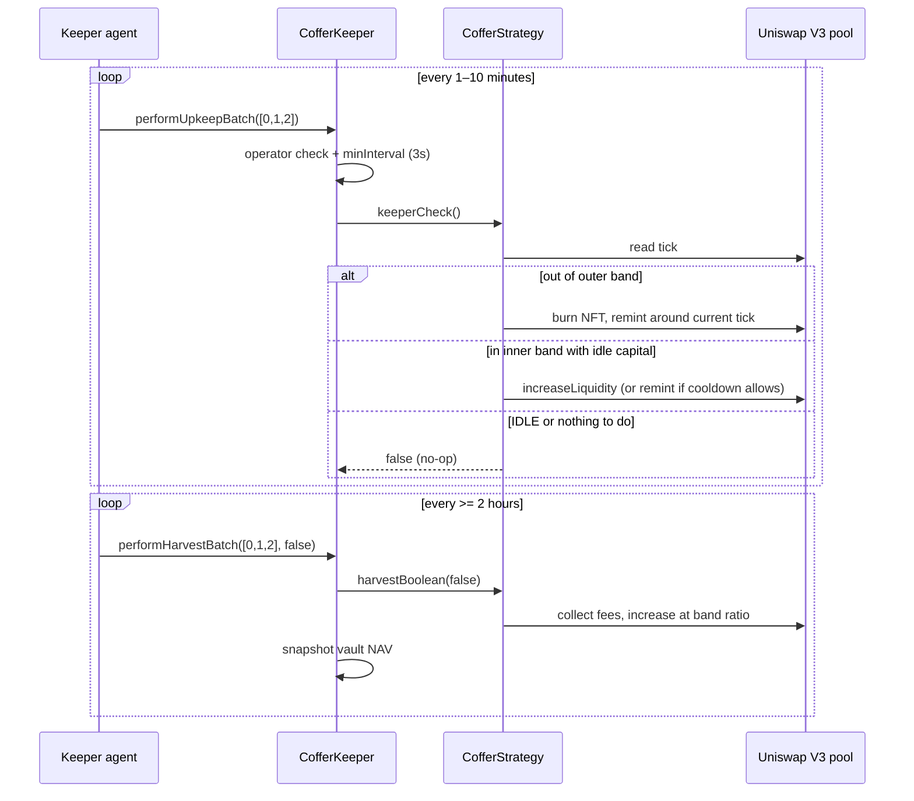

# Coffer

Coffer is a live **multi-strategy allocator vault** on Robinhood Chain. A single share token sits over several concentrated Uniswap V3 positions, and an off-chain keeper agent keeps those positions in range and harvests fees.

| | |
| --- | --- |
| Network | Robinhood Chain (chain id **4663**) |
| Source | [`contracts/coffer/`](contracts/coffer/) |
| Foundry profile | `coffer` |
| License | [MIT](LICENSE) |

---

## Table of contents

- [Overview](#overview)
- [Live deployment](#live-deployment)
- [Architecture](#architecture)
- [Vault behaviour](#vault-behaviour)
- [Keeper operations](#keeper-operations)
- [Technology](#technology)
- [Repository layout](#repository-layout)
- [Design rationale](#design-rationale)

---

## Overview

Depositors send ETH. The vault wraps it to aeWETH and mints **CofferLiquidShares**. Each share is a claim on the *entire* allocator rather than on any single pair, so a loss in one position is already reflected in everyone's share price.

Beneath the vault sit independent **CofferStrategy** contracts. Each holds one Uniswap V3 position NFT — a tick band around the current price — together with a reserve of idle capital so that harvests and remints do not have to sell the volatile leg on every pass.

Key properties:

- **One share, many pairs.** Depositors receive volatile, equity, and gold exposure without choosing a pool.
- **No cross-selling.** New deposits are routed toward underweight strategies; the vault never swaps between strategies.
- **Failure isolation.** Keeper batches wrap each strategy in `try/catch`, so one pair's bad hour cannot block the others.
- **No clone factory.** Every contract is constructed and wired in a single deployment. A vault supports up to eight strategies.

---

## Live deployment

### Core contracts

| Contract | Address | Role |
| --- | --- | --- |
| `CofferVault` | `0x948c683a5885D49383C8d94Fc1827a036543E803` | Allocator; share mint/burn; deposit routing |
| `CofferLiquidShares` | `0xF2736eE8361241B283c1e579B5173eb9aB54EBD1` | ERC-20 share token |
| `CofferKeeper` | `0xAf132C43E60c09b657267ebce75a1a34e8DBE9a0` | Sole entrypoint for the keeper agent |
| `CofferOperatorRegistry` | `0x932faEB584254e776Dc39B8A5FF55ec6319bBf82` | Allowlist of keeper EOAs |
| `CofferSwapRouter` | `0x62B49Ea133C32D91b255043e87DDD0667B784d6a` | TWAP-floored exact-in swaps; strategies must be authorized |
| `CofferStrategy` | watched ids `0..2` | One concentrated LP position, reserve, and rotation logic per strategy |

> **Note:** `CofferOperatorRegistry` is distinct from the AutoVault operator registry (`0xCB43a99c…`). An AutoVault operator key cannot drive Coffer until it has been added via `addOperator` on this registry.

### Strategies

The live deployment runs three strategies at roughly equal target weights.

| Leg | Pair | Purpose |
| --- | --- | --- |
| Volatile | CASHCAT / aeWETH 1% | High-fee alt beta. The operator may rotate into other allowed assets (PONS, PIPEDOG, TENDIES, JUGGERNAUT). The reserve is quote-only, so a rotation never has to sell the alt. |
| Stock | AMZN / USDG 0.30% | Dollar-quoted equity LP. The operator may rotate to MSFT. |
| Stock | GLD / USDG 0.30% | Dollar-quoted gold LP. The operator may rotate to SGOV. |

Stock legs are quoted in **USDG**, while the vault's unit of account is **aeWETH**. Those strategies therefore convert through the WETH/USDG 0.01% pool on entry and exit. The volatile leg already quotes in aeWETH and skips that hop.

---

## Architecture

```text
User  --ETH-->  CofferVault  --shares-->  CofferLiquidShares
                     |
                     |  routes aeWETH by target weight
                     v
              CofferStrategy x N     (one Uniswap V3 NFT per pair)
                     |
                     |  swaps via
                     v
              CofferSwapRouter  ----->  Uniswap V3 pools (Robinhood)

Keeper agent  --operator txs-->  CofferKeeper  --onlyKeeper-->  each strategy
                                      ^
                                      |
                             CofferOperatorRegistry  (who may call the keeper)
```

Coffer is derived from the RhV3 AutoVault strategy and generalized with:

- a configurable quote token;
- USDG → WETH conversion for dollar-quoted legs;
- a per-strategy `PAIRED` or `QUOTE_ONLY` reserve mode;
- UFloat-style `changeAsset` rotation with an `IDLE` state.

Harvest no longer rebalances inventory through a swap. It collects fees and adds liquidity at the current band ratio — the principal lesson taken from the earlier live RhV3 vaults.

---

## Vault behaviour

The following operations run entirely on-chain and do not depend on the keeper agent.

### Deposit

1. Wrap ETH to aeWETH.
2. Price shares at `min(spot NAV, TWAP-gated NAV)`, so a short-lived pool spike cannot mint excess shares.
3. Route aeWETH toward whichever strategies are below their target weight.

The vault never swaps between strategies.

### Withdraw

1. Burn shares.
2. Take the same fraction from every strategy, including retired ones.
3. Pay out in aeWETH.

If converting the non-quote token would breach the TWAP floor, the remainder is paid in kind so the exit still completes.

### Rotate

An operator may call `changeAsset` (or `exitToQuote` followed by re-entry) to move a strategy onto another allowed pool. While a strategy is `IDLE`, the keeper performs no actions on it.

### What requires the agent

The contracts cannot, on their own, watch the pool tick and move the NFT when price leaves the band, or collect fees on a schedule. Those two jobs belong to the off-chain keeper agent.

---

## Keeper operations

The agent is an **operator**, not the owner. It holds a hot key for which `CofferOperatorRegistry.isOperator` returns `true`. All keeper work must go through **CofferKeeper** so that `lastUpkeep` and `lastHarvest` remain accurate. Do not call `keeperCheck` or `harvestBoolean` on strategies directly.



### Cadences

| Job | Call | Effect | Frequency |
| --- | --- | --- | --- |
| Stay in range | `performUpkeepBatch(uint256[] ids)` | Remint when price leaves the outer ticks; add idle capital while still within the inner band. | Every few minutes. The keeper `minInterval` is 3 s (a floor, not a target). In-range remints also wait `minHarvestDelay` (default **2 hours**) to prevent NFT churn. Out-of-range remints are not delayed. |
| Harvest | `performHarvestBatch(uint256[] ids, false)` | Collect Uniswap fees and compound them as liquidity. No inventory swap. | At least every 2 hours. Earlier calls are a no-op on-chain. |

Guidelines:

- **Always use the batch entrypoints.** The batch wraps each call in `try/catch` and emits `UpkeepFailed(id, strat, reason)`, so a failure on one pair does not block the others. The single-id calls revert and abort the remainder.
- `skipIncreaseLiquidity = true` collects fees and stops. Production runs pass `false`.
- If a strategy is `IDLE` (the operator is rotating its asset), `keeperCheck` returns `false` and the agent should leave it alone.
- Enumerate live ids from `strategiesLength()` / `watched(id)` rather than assuming a single `CofferStrategy` address from the ABI. `watched` returns `(stratAddr, minInterval, lastUpkeep, lastHarvest, active)`.

### Example

```bash
# Confirm the agent key is an operator
cast call 0x932faEB584254e776Dc39B8A5FF55ec6319bBf82 \
  "isOperator(address)(bool)" $AGENT_ADDRESS --rpc-url $ROBINHOOD_MAIN_RPC_URL

# Range check / remint
cast send 0xAf132C43E60c09b657267ebce75a1a34e8DBE9a0 \
  "performUpkeepBatch(uint256[])" "[0,1,2]" \
  --rpc-url $ROBINHOOD_MAIN_RPC_URL --private-key $AGENT_KEY

# Harvest and compound
cast send 0xAf132C43E60c09b657267ebce75a1a34e8DBE9a0 \
  "performHarvestBatch(uint256[],bool)" "[0,1,2]" false \
  --rpc-url $ROBINHOOD_MAIN_RPC_URL --private-key $AGENT_KEY
```

### Prohibited actions

The agent must not:

- drive Coffer through AutoVault keepers (`AutoKeeperRhV3`, `AutoKeeperRhV4`, `AutoKeeperSv3`);
- call `changeAsset`, `exitToQuote`, or `setBandParams` from the upkeep/harvest loop — these are operator/owner administrative actions, not part of the cadence;
- expect a V4-style `refreshPriceRef`. Coffer prices off Uniswap V3 TWAP.

---

## Technology

| Layer | Choice |
| --- | --- |
| Chain | Robinhood Chain, EVM, chain id **4663** |
| Language | Solidity **0.8.26**, Cancun, `viaIR`, optimizer runs **1** |
| Tooling | Foundry (`forge`, `cast`), profile `coffer` |
| Libraries | OpenZeppelin `Ownable`, `ReentrancyGuard`, `SafeERC20`, `Math` |
| AMM | Uniswap V3 (factory, NonfungiblePositionManager, SwapRouter02, QuoterV2 — addresses compiled into `V3Deployments4663.sol`) |
| Pricing | Pool `observe` TWAP (default 30-minute window, 3% spot-deviation gate) |
| Tokens | aeWETH `0x0Bd7D308…`, USDG `0x5fc5360D…` |
| Off-chain | Operator agent on EC2 holding a key registered in `CofferOperatorRegistry`, with RPC access to chain 4663 |
| Tests | `test/CofferVault.t.sol` (unit), `test/CofferFork.t.sol` (Robinhood fork) |

ABIs are published under `rh-abis/coffer/`.

---

## Repository layout

```text
contracts/coffer/
├── CofferVault.sol              Allocator and share accounting
├── CofferLiquidShares.sol       ERC-20 share token
├── CofferStrategy.sol           Concentrated LP + reserve + rotation
├── CofferStrategyManager.sol    Strategy administration
├── CofferKeeper.sol             Batch upkeep / harvest entrypoint
├── CofferOperatorRegistry.sol   Keeper allowlist
├── CofferSwapRouter.sol         TWAP-floored swaps
├── V3Deployments4663.sol        Uniswap V3 addresses for chain 4663
├── interfaces/                  ICoffer* and Uniswap V3 interfaces
└── libraries/                   AutoBandLib, CofferSwapLib, LiquidityLibraryV2,
                                 TickMath, TrailingFloorLib, TwapQuoteLib
```

---

## Design rationale

Single-pair AutoVaults on Robinhood already ran concentrated bands with an EC2 keeper. Coffer keeps that keeper model and lifts it over **several** pairs behind one share, so a depositor gains volatile, equity, and gold exposure without selecting a pool.

The vault only allocates new ETH toward underweight legs; it does not cross-sell positions, because that would pay swap costs for a rebalance nobody requested. The agent's job stays deliberately narrow: keep each NFT in range, harvest fees, and isolate failures.
